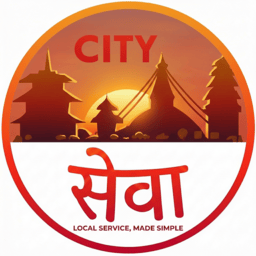

# CitySewa — HyperLocal Service Marketplace

<p align="center">
    
</p>

[](https://citysewa2.onrender.com)


---

## 📖 What is CitySewa?

**CitySewa** is a hyperlocal service marketplace platform that connects **customers** with **nearby service providers** — from electricians and plumbers to tutors and cleaners. Think of it as a one-stop digital hub where people can discover, book, and manage local services with ease, while providers get a direct channel to showcase their skills and receive bookings.

The project deliberately avoids Django's ORM in favor of **raw SQL** with a custom database manager, making it an excellent learning resource for understanding database interactions at a lower level.

🔗 **Live App Demo:** [https://citysewa.vercel.app](https://citysewa.vercel.app)

🔗 **Admin Dashboard:** [https://citysewa-admin.vercel.app](https://citysewa-admin.vercel.app)

🔗 **Backend:** [https://citysewa2.onrender.com](https://citysewa2.onrender.com)

---

## 🎯 Who is it For?

| User Role             | Description                                                                                                                                   |
| --------------------- | --------------------------------------------------------------------------------------------------------------------------------------------- |
| **Customers**         | People looking for local services — browse providers, book services, manage addresses, and track bookings.                                    |
| **Service Providers** | Skilled professionals (electricians, tutors, etc.) who want to list their services, get verified, and receive bookings from nearby customers. |
| **Admins**            | Platform administrators who oversee users, services, and the overall marketplace operations.                                                  |

---

## ✨ Features

### For Customers

- 🔍 **Browse & Discover** — Search and explore local services by category
- 📅 **Book Services** — Schedule service appointments with date and time selection
- 📍 **Address Management** — Save and manage multiple addresses for service delivery
- 👤 **Profile Management** — Maintain and update personal profile information
- 📊 **Dashboard** — Track active and past bookings in one place

### For Service Providers

- 📝 **Registration & Onboarding** — Easy sign-up and profile setup
- ✅ **Verification System** — Upload identity documents for account verification
- 🛠️ **Service Listings** — Create and manage service offerings with pricing
- 📋 **Booking Management** — View and manage incoming customer bookings
- 👤 **Profile Management** — Update business details and descriptions

### For Admins

- 👥 **User Management** — Oversee all customers and providers on the platform
- 🏷️ **Service Oversight** — Monitor and manage all listed services
- 📊 **Admin Dashboard** — Central control panel for platform operations

### Platform-Wide

- 🔐 **Role-Based Authentication** — Separate login flows for customers, providers, and admins
- 🌐 **Responsive Web App** — Full-featured React web interface
- 📱 **Mobile Apps** — Flutter-based native mobile experiences
- 📄 **API Documentation** — Interactive Swagger/OpenAPI docs
- 🗄️ **ORM-Free Architecture** — Raw SQL with custom database manager for full control

---

## 🏗️ Core Products

This monorepo contains **four** core products that work together:

### 1. 🌐 Web App — `Frontend/`

A full-featured **React + Vite** web application serving as the primary user interface.

| Tech             | Details                      |
| ---------------- | ---------------------------- |
| React            | v19 — UI library             |
| Vite             | v7 — Build tool & dev server |
| React Router DOM | v7 — Client-side routing     |
| Axios            | HTTP client for API calls    |
| ESLint           | Code quality & linting       |

**Supports multiple user experiences:**

- **Public browsing** — Home, About, and Services pages (no login required)
- **Customer flows** — Dashboard, bookings, addresses, and profile
- **Provider flows** — Dashboard, service management, and profile
- **Admin flows** — Dashboard, user management, and service oversight

**Quick Start:**

```bash
cd Frontend
npm install
# Create .env with: VITE_API_URL=https://citysewa2.onrender.com/api/v1
npm run dev
```

---

### 2. 📱 Provider App — `citysewa_provider/`

A **Flutter** mobile application built specifically for service providers.

| Tech      | Details                        |
| --------- | ------------------------------ |
| Flutter   | 3.x — Cross-platform framework |
| Dart      | SDK ^3.10.1                    |
| Platforms | Android, iOS, and Web          |

**Key Features:**

- Branded splash screen with session-aware navigation
- Provider login & registration
- Profile view/edit
- Document upload for verification
- Add and manage service listings
- View incoming bookings
- Token-based session persistence

**Quick Start:**

```bash
cd citysewa_provider
flutter pub get
flutter run          # Android/iOS
flutter run -d chrome  # Web
```

---

### 3. 📱 Customer App — `citysewa_customer/`

A **Flutter** mobile application shell for customer-facing demo views and app-like flows.

**Quick Start:**

```bash
cd citysewa_customer
flutter pub get
flutter run
```

---

### 4. ⚙️ Backend API — `Backend/`

A **Django + Django REST Framework** service layer powering all client applications.

| Tech            | Details                              |
| --------------- | ------------------------------------ |
| Python          | 3.12+                                |
| Django          | 5.2                                  |
| DRF             | 3.16                                 |
| drf-spectacular | OpenAPI / Swagger docs               |
| PostgreSQL      | Production database                  |
| SQLite          | Local development mode               |
| Supabase        | Postgres database and S3 filestorage |
| Gunicorn        | Production WSGI server               |
| Sentry SDK      | Optional error monitoring            |

**Key API Endpoints:**

| Route                  | Description                         |
| ---------------------- | ----------------------------------- |
| `api/v1/accounts/...`  | Authentication & account management |
| `api/v1/services/...`  | Service listing & CRUD              |
| `api/v1/bookings/...`  | Booking listing & CRUD              |
| `api/v1/addresses/...` | Address listing & CRUD              |
| `api/v1/docs`          | Interactive Swagger documentation   |
| `api/v1/schema`        | OpenAPI 3.0 schema (JSON)           |

**Database Tables:** `users`, `tokens`, `customers`, `providers`, `documents`, `services`, `districts`, `locations`, `addresses`, `bookings`

**Quick Start:**

```bash
cd Backend
uv venv && uv sync
cp .env.example .env   # Configure your environment
python manage.py custommigrate
python manage.py runserver
```

---

## 🏛️ High-Level Architecture

```
┌─────────────────┐   ┌──────────────────────┐   ┌─────────────────────┐
│   React Web App │   │  Flutter Provider App│   │ Flutter Customer App│
│   (Frontend/)   │   │ (citysewa_provider/) │   │(citysewa_customer/) │
└────────┬────────┘   └──────────┬───────────┘   └──────────┬──────────┘
         │                       │                          │
         └───────────┬───────────┴──────────────────────────┘
                     │  HTTPS  /api/v1
                     ▼
          ┌──────────────────────┐
          │  Django REST Backend │
          │     (Backend/)       │
          │   Raw SQL · No ORM   │
          └──────────┬───────────┘
                     │
          ┌──────────▼───────────┐
          │     PostgreSQL       │
          │  (SQLite for local)  │
          └──────────┬───────────┘
                     │  file store
                     ▼
          ┌──────────────────────┐
          │      Supabase S3     │
          └──────────────────────┘
```

---

## 📂 Repository Layout

```
CItysewa-noORM/
├── Backend/              # Django REST API (Python)
├── Frontend/             # React + Vite web app (JavaScript)
├── citysewa_provider/    # Flutter provider mobile app (Dart)
├── citysewa_customer/    # Flutter customer mobile app (Dart)
├── mobile_app_demo/      # Mobile app demo in web format
└── README.md             # This file
```

---

## 🚀 Getting Started

### Prerequisites

| Component   | Requirement                                                                |
| ----------- | -------------------------------------------------------------------------- |
| Backend     | Python 3.12+, [`uv`](https://docs.astral.sh/uv/) package manager           |
| Frontend    | Node.js ≥ 18, npm ≥ 9                                                      |
| Mobile Apps | [Flutter SDK](https://docs.flutter.dev/get-started/install) (Dart ^3.10.1) |
| Database    | PostgreSQL (production) or SQLite (local dev)                              |

### Quick Start (Full Stack — Local)

```bash
# 1. Clone the repository
git clone https://github.com/AMAYKJHA/CItysewa-noORM.git
cd CItysewa-noORM

# 2. Start the Backend
cd Backend
uv venv && uv sync
cp .env.example .env
# Set LOCAL=True and DEBUG=True in .env for SQLite mode
python manage.py custommigrate
python manage.py runserver
# Backend running at http://localhost:8000

# 3. Start the Frontend (in a new terminal)
cd ../Frontend
npm install
echo "VITE_API_URL=http://localhost:8000/api/v1" > .env
npm run dev
# Frontend running at http://localhost:5173

# 4. Run the Provider App (in a new terminal)
cd ../citysewa_provider
flutter pub get
flutter run -d chrome
```

---

## 🌍 Live Deployment

| Service                | URL                                                                                      |
| ---------------------- | ---------------------------------------------------------------------------------------- |
| **Web App + API**      | [https://citysewa2.onrender.com](https://citysewa2.onrender.com)                         |
| **API Docs (Swagger)** | [https://citysewa2.onrender.com/api/v1/docs](https://citysewa2.onrender.com/api/v1/docs) |

The backend is deployed on **Render.com** using Gunicorn with PostgreSQL as the production database.

---

## 🤝 Contributing

Contributions are welcome! Feel free to open issues or submit pull requests to improve CitySewa.

1. Fork the repository
2. Create a feature branch (`git checkout -b feature/amazing-feature`)
3. Commit your changes (`git commit -m 'Add amazing feature'`)
4. Push to the branch (`git push origin feature/amazing-feature`)
5. Open a Pull Request

---

## 📜 License

This project is licensed under the **MIT License**.
